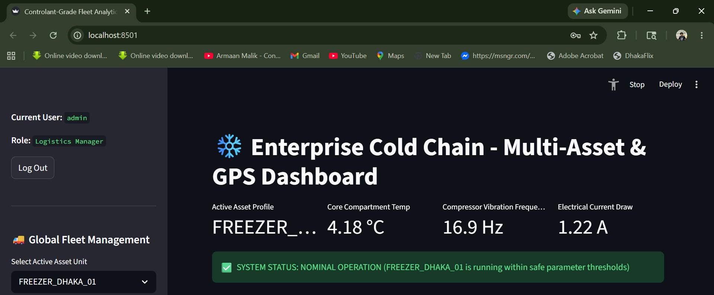
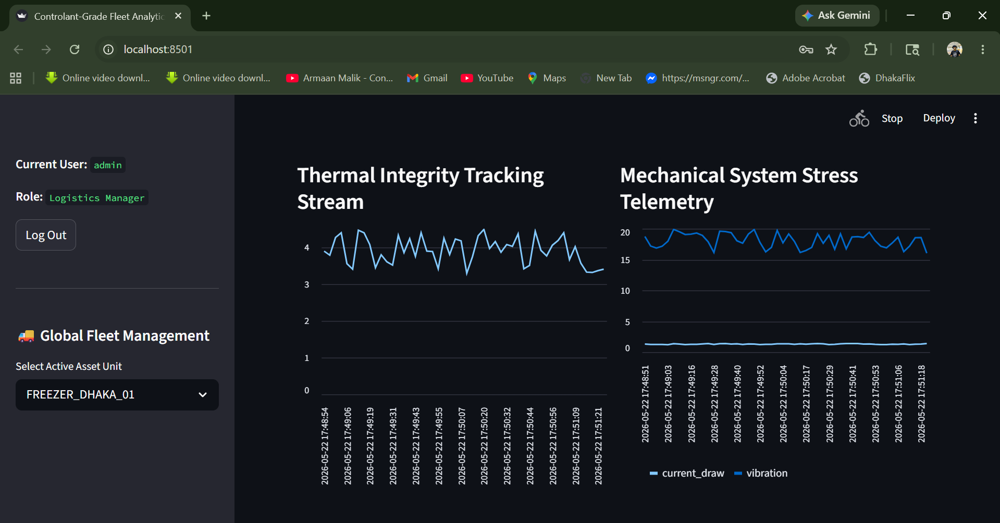
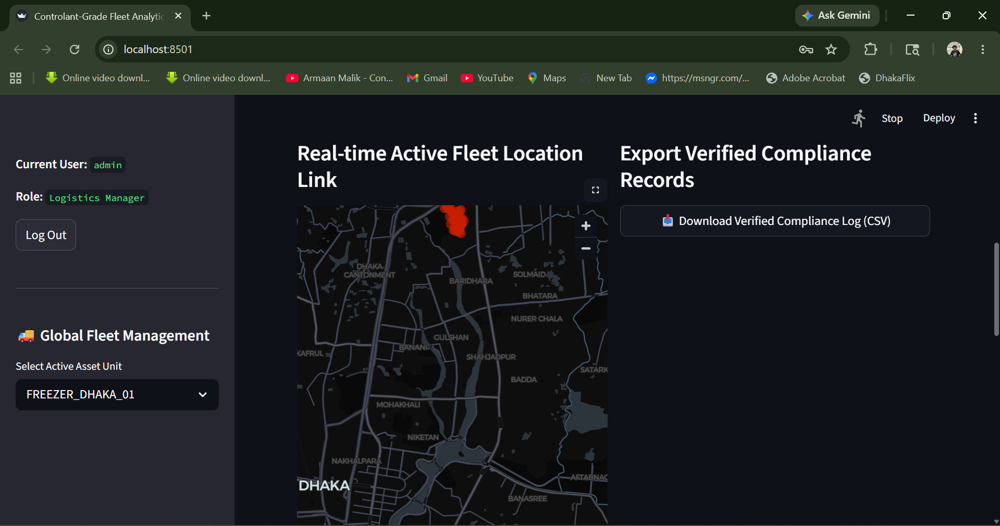
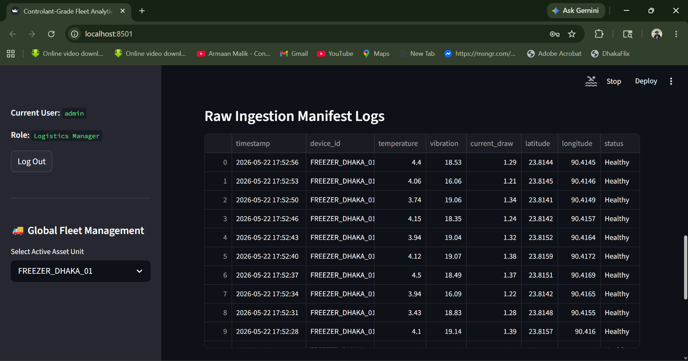
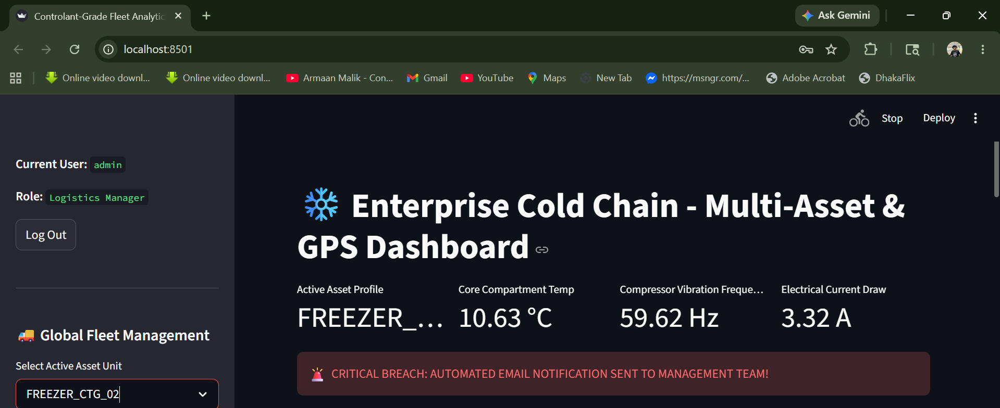
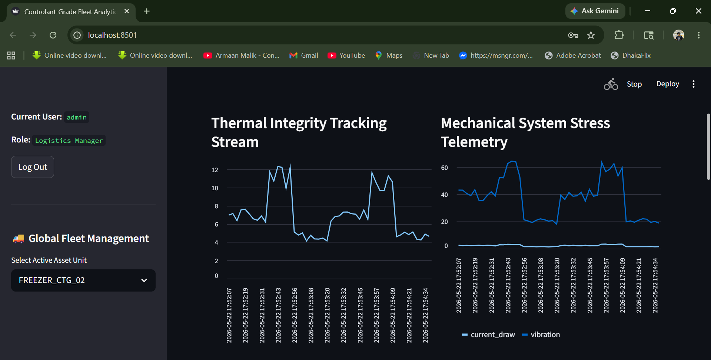
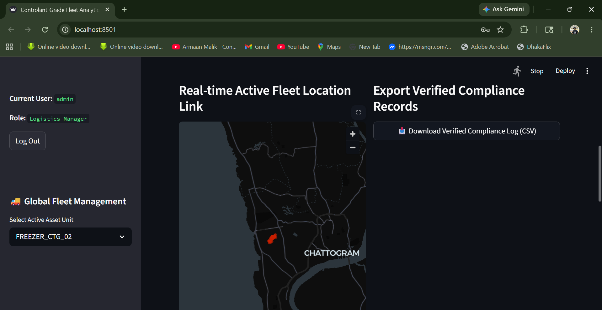
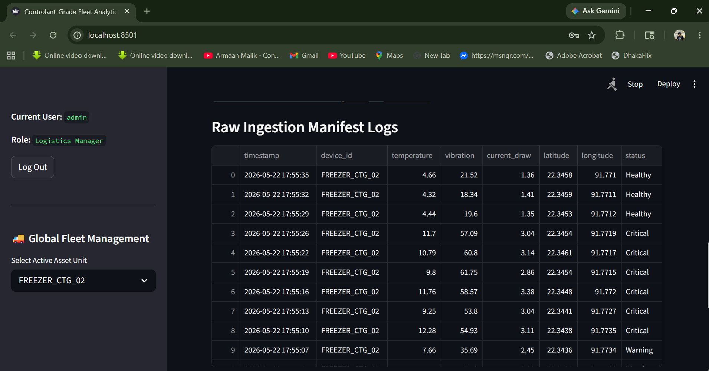
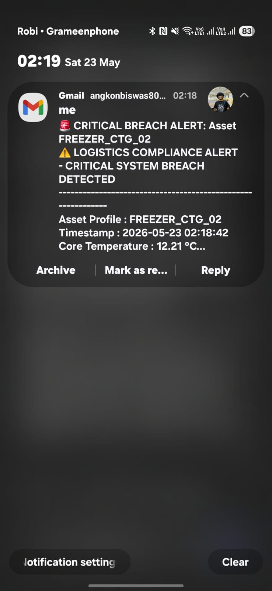
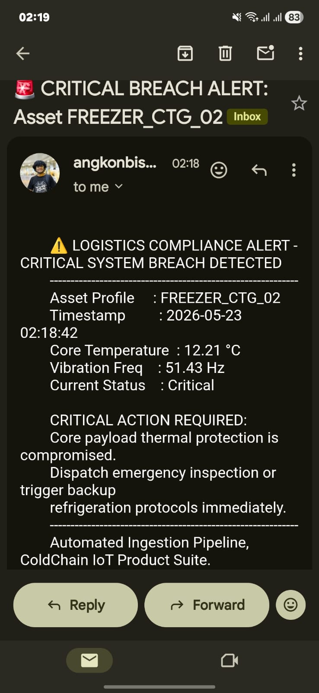

# ❄️ ColdChain Guardian

**Enterprise-grade Cold Chain & GPS Dashboard**

*A containerized analytics solution for real-time asset monitoring and predictive maintenance of refrigerated fleets in Bangladesh.*

---

## 📸 Screenshots

### 1. FREEZER_DHAKA_01 (Dhaka Region)

**Dashboard Overview (Nominal Operation)**


**Thermal Integrity & Mechanical Telemetry**


**Real-time GPS Location (Dhaka)**



---

### 2. FREEZER_CTG_02 (Chittagong Region)

**Critical Breach Dashboard**


**Thermal Integrity Tracking (Temperature Spike)**


**Real-time GPS Location (Chittagong)**


**Raw Ingestion Manifest Logs**


---

### 3. Critical Alert Notifications

**Mobile Gmail Alert**


**Detailed Critical Action Email**


---

## 🌟 Key Features

- **Real-time Monitoring**: Temperature, Vibration Frequency & Electrical Current Draw
- **Live GPS Tracking**: Interactive map visualization (Dhaka & Chittagong)
- **Predictive Maintenance**: Compressor degradation detection
- **Automated Alerts**: Critical breach notification via Email
- **Compliance Management**: Raw logs & CSV export
- **Multi-Asset Support**: Easy switching between fleet units

---

🚀 Overview
​ColdChain-Guardian is an industry-grade monitoring solution designed for real-time visibility into the health and location of critical temperature-controlled logistics assets. It aggregates complex telemetry (temperature, vibration, GPS, electrical draw) into a single, elegant interface, providing critical warnings for thermal integrity or mechanical system stress.

---

## 🏗️ System Architecture

```mermaid
flowchart TD
    subgraph "IoT Layer"
        A[Sensors: Temp, Vibration, Current, GPS] --> B[ESP32 / Raspberry Pi Gateway]
    end
    B --> C[MQTT Broker]
    C --> D[Data Ingestion Pipeline]
    D --> E[TimescaleDB]
    E --> F[FastAPI Backend]
    F --> G[React Dashboard]
    F --> H[Alert Engine]
    H --> I[Email Notification]
    
🛠️ Tech Stack

Layer
Technologies
Frontend
React.js + TailwindCSS + Recharts + Leaflet
Backend
FastAPI / Node.js + WebSocket
Database
TimescaleDB (PostgreSQL)
IoT
MQTT, ESP32, DS18B20, MPU6050, ACS712
Deployment
Docker + Docker Compose

🛠️ Tech Stack
Layer
Technologies
Frontend
React.js + TailwindCSS + Recharts + Leaflet
Backend
FastAPI / Node.js + WebSocket
Database
TimescaleDB (PostgreSQL)
IoT
MQTT, ESP32, DS18B20, MPU6050, ACS712
Deployment
Docker + Docker Compose

🚀 Quick Start
# Clone the repository
git clone https://github.com/angkonbiswas80-del/coldchain-guardian.git
cd coldchain-guardian

# Start the application
docker-compose up -d

Access the Dashboard:
Open your browser and go to http://localhost:8501

📁 Project Structure

coldchain-guardian/
├── frontend/              # React Dashboard
├── backend/               # API & Business Logic
├── iot/                   # ESP32 Firmware
├── database/              # Schema & Migrations
├── screenshots/           # All dashboard screenshots
├── docker-compose.yml
├── README.md
└── .env.example